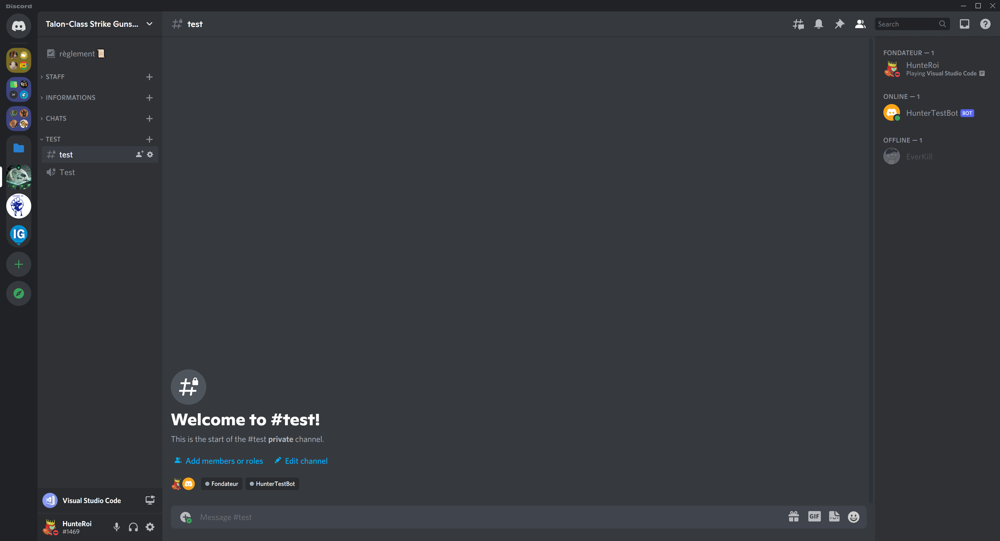

<a href="https://www.npmjs.com/@hunteroi/discord-temp-channels"></a>

# Discord Temporary Voice Channels

This library works the same way its parent does (see [discord-temp-channels](https://github.com/Androz2091/discord-temp-channels) of [Androz2091](https://github.com/Androz2091)) except that it brings a few new features:

- create/delete a temporary text channel via an event
- more events like `voiceChannelCreate`, `textChannelCreate` and **4 more**
- give the temporary channels' owner the `MANAGE_CHANNELS` permission on them
- give more permissions to users/roles when channels are created (via registered parent options)
- auto-prefix renamed temporary channels if the prefix is missing
- reload temporary channels in memory in case the bot restarts while the feature is being used
- Source code embedded documentation with [JSDoc](https://en.wikipedia.org/wiki/JSDoc)



## Prerequisites ⚠️

Starting at **v2.0.0**, you must use **NodeJS v16.6.0 or higher** to run a bot with this library.

You also must not forget to include **mandatory intents** as well as give your bot the rights to **manage application commands**.

## Installation

```sh
npm install --save @hunteroi/discord-temp-channels
```

## Examples

See [./example/index.js](example/index.js) and [./example/index2.js](example/index2.js).

<br />

⚠️ Please be aware that using slash commands in temporary text channels might raise exceptions in your event listeners. I highly suggest that you wrap your listeners' code in a try-catch block (or use the then/catch chaining methods of the `Promise` class in case you don't apply the async/await pattern).

For exemple, if you try to execute `interaction.editReply` after the interaction's channel has been deleted, you will receive an error in your console.

## Events

```ts
manager.on(
	TempChannelsManagerEvents.channelRegister,
	(parent: ParentChannelData) => {}
);

manager.on(
	TempChannelsManagerEvents.channelUnregister,
	(parent: ParentChannelData) => {}
);

manager.on(
	TempChannelsManagerEvents.voiceChannelCreate,
	(voiceChannel: VoiceChannel) => {}
);

manager.on(
	TempChannelsManagerEvents.voiceChannelDelete,
	(voiceChannel: VoiceChannel) => {}
);

manager.on(
	TempChannelsManagerEvents.voiceNotExisting,
	(interaction: Interaction) => {}
);

manager.on(
	TempChannelsManagerEvents.textChannelCreate,
	(textChannel: TextChannel, interaction: Interaction | undefined) => {}
);

manager.on(
	TempChannelsManagerEvents.textChannelDelete,
	(textChannel: TextChannel, interaction: Interaction | undefined) => {}
);

manager.on(
	TempChannelsManagerEvents.childPrefixChange,
	(channel: GuildChannel) => {}
);

manager.on(
	TempChannelsManagerEvents.childCreate,
	(
		member: GuildMember | ClientUser,
		child: ChildChannelData,
		parent: ParentChannelData
	) => {}
);

manager.on(
	TempChannelsManagerEvents.childDelete,
	(
		member: GuildMember | ClientUser,
		child: ChildChannelData,
		parent: ParentChannelData
	) => {}
);

manager.on(
	TempChannelsManagerEvents.error,
	(error: Error, message: string) => {}
);
```

## Commands

In order to trigger the creation/deletion of a text channel, please emit the `TempChannelsManagerEvents.createText` event using your instance of the `TempChannelsManager` class and pass it the interaction object:

```ts
client.on('interactionCreate', async (interaction) => {
	if (interaction.isCommand() && interaction.commandName === 'createtext') {
		await interaction.deferReply();
		client.tempChannelsManager.emit(
			TempChannelsManagerEvents.createText,
			interaction
		);
	}
});
```

## Contribution

Contributions are what make the open source community such an amazing place to be learn, inspire, and create. Any contributions you make are greatly appreciated.

1. Fork the Project
2. Create your Branch: `git checkout -b patch/YourAmazingWork`
3. Commit your Changes: `git commit -m 'Add some amazing work'`
4. Push to the Branch: `git push origin patch/YourAmazingWork`
5. Open a Pull Request

## Credits

Thanks to [Androz2091](https://github.com/Androz2091) for their initial package. This package is a fork of their own work. Check them out!
